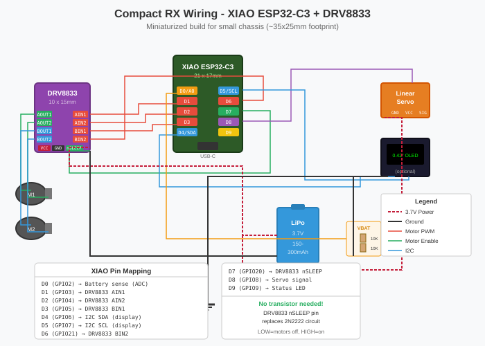

# Compact Build Guide - Miniaturized Receiver

**Target:** Hot Wheels sized chassis (~75mm x 25mm)
**RX Footprint:** ~35mm x 25mm (stacked components)

---

## Overview

This guide covers building a miniaturized receiver (RX) using smaller components while keeping the standard transmitter (TX). The compact RX replaces:

| Original | Compact Replacement | Size Reduction |
|----------|---------------------|----------------|
| ESP32-C3 Super Mini | Seeed XIAO ESP32-C3 | 22x18mm → 21x17mm |
| MX1508 + 2N2222 | DRV8833 | Simpler, smaller |
| SG90 Servo | Micro linear servo | Much smaller |
| 1.3" OLED | 0.42" OLED (optional) | 35x15mm → 12x10mm |
| USB power | LiPo + built-in charging | Portable |

---

## Wiring Diagram



---

## Component Selection

### Seeed XIAO ESP32-C3 (Required)

**Size:** 21mm x 17.5mm (smallest ESP32 module)

**Key Features:**
- Built-in LiPo battery charging via USB-C
- Same ESP32-C3 chip, same code compatibility
- 11 GPIO pins exposed
- Only 3 ADC pins (GPIO2-4), enough for battery monitoring

**Pin Mapping:**
| XIAO Pin | GPIO | Function | Notes |
|----------|------|----------|-------|
| D0 | GPIO2 | Battery voltage | ADC capable |
| D1 | GPIO3 | Motor 1 AIN1 | PWM |
| D2 | GPIO4 | Motor 1 AIN2 | PWM |
| D3 | GPIO5 | Motor 2 BIN1 | PWM |
| D4 | GPIO6 | I2C SDA | Display |
| D5 | GPIO7 | I2C SCL | Display |
| D6 | GPIO21 | Motor 2 BIN2 | PWM |
| D7 | GPIO20 | DRV8833 nSLEEP | Motor enable |
| D8 | GPIO8 | Servo signal | PWM |
| D9 | GPIO9 | Status LED | Digital |

**Purchase:** [Seeed Studio](https://www.seeedstudio.com/Seeed-XIAO-ESP32C3-p-5431.html) ~$5

### DRV8833 Motor Driver (Required)

**Size:** 10mm x 15mm (breakout board)

**Why DRV8833 over MX1508:**
- Smaller footprint
- Built-in sleep mode (nSLEEP pin) - **no transistor circuit needed!**
- Better efficiency (less heat)
- Works at 2.7-10.8V (perfect for 3.7V LiPo)
- Same PWM control logic

**Wiring:**
| DRV8833 Pin | Connect To |
|-------------|------------|
| VCC | LiPo+ (3.7V) |
| GND | Common ground |
| AIN1 | XIAO D1 (GPIO3) |
| AIN2 | XIAO D2 (GPIO4) |
| BIN1 | XIAO D3 (GPIO5) |
| BIN2 | XIAO D6 (GPIO21) |
| nSLEEP | XIAO D7 (GPIO20) |
| AOUT1/2 | Motor 1 |
| BOUT1/2 | Motor 2 |

**nSLEEP replaces transistor circuit:**
- LOW = motors disabled (sleep mode)
- HIGH = motors enabled
- Code sets HIGH after initialization

**Purchase:** Search "DRV8833 breakout" on AliExpress ~$2

### Linear Servo (Required)

For tight spaces, use a linear servo instead of rotary:

**Recommended Options:**
| Model | Size | Stroke | Voltage |
|-------|------|--------|---------|
| PZ-15320 | 23x12x6mm | 20mm | 4.8-6V |
| L12-I | 20x8xL | 10-50mm | 6V |
| Micro linear actuator | varies | varies | 3-6V |

**Note:** Most servos need 4.8V+. Options:
1. Small boost converter (MT3608 mini) to get 5V
2. Run at 3.7V (reduced torque, may work for light loads)
3. Use 3.3V compatible servo (rare)

### Display (Optional - for prototyping)

**0.42" OLED** - Smallest option
- Size: 12mm x 10mm
- Resolution: 72x40 pixels
- Interface: I2C
- Voltage: 3.3V

Can be removed for final build to save space/weight.

### LiPo Battery

**Recommended sizes for Hot Wheels chassis:**

| Size Code | Dimensions | Capacity | Runtime* |
|-----------|------------|----------|----------|
| 301020 | 10x20x3mm | 60mAh | ~15min |
| 401120 | 11x20x4mm | 80mAh | ~20min |
| 501220 | 12x20x5mm | 100mAh | ~25min |
| 401230 | 12x30x4mm | 150mAh | ~40min |
| 602025 | 20x25x6mm | 200mAh | ~50min |

*Runtime estimates with motors at 50% average duty

**XIAO has built-in charging!** Just plug in USB-C to charge.

### Boost Converter (Optional - for servo)

If servo needs 5V:

**MT3608 Mini Module**
- Size: 12mm x 10mm
- Input: 2-24V
- Output: 5-28V (adjustable)
- Adjust to 5.0V before use

---

## Bill of Materials (Compact RX)

### Required Components

| Qty | Component | Size | Est. Price |
|-----|-----------|------|------------|
| 1 | Seeed XIAO ESP32-C3 | 21x17mm | $5 |
| 1 | DRV8833 breakout | 10x15mm | $2 |
| 2 | Micro DC motors | varies | $3 |
| 1 | Micro linear servo | ~20x10mm | $8 |
| 1 | LiPo battery (100-200mAh) | ~12x20mm | $4 |
| 2 | 10K resistors (0402/0603) | tiny | $0.10 |
| 1 | 100µF capacitor (SMD) | small | $0.20 |
| - | Thin wire (30AWG) | - | $2 |

**Total: ~$25**

### Optional Components

| Qty | Component | Purpose |
|-----|-----------|---------|
| 1 | 0.42" OLED display | Debugging (remove for final) |
| 1 | MT3608 mini boost | 5V for servo |
| 1 | Slide switch | Power on/off |
| 1 | JST 1.25mm connector | Battery connection |

---

## Power Analysis

### Voltage Levels

| Component | Required | From 3.7V LiPo |
|-----------|----------|----------------|
| XIAO ESP32-C3 | 3.3V | Internal regulator |
| DRV8833 | 2.7-10.8V | Direct |
| DC Motors | 3-6V | Via DRV8833 |
| Linear Servo | 4.8-6V | Needs boost OR run at 3.7V |
| Display | 3.3V | From XIAO 3.3V pin |

### Current Budget

| Component | Typical | Peak |
|-----------|---------|------|
| XIAO (BLE active) | 80mA | 150mA |
| DRV8833 (idle) | 1mA | - |
| Motors (x2) | 200mA | 600mA |
| Servo | 50mA | 200mA |
| Display | 10mA | 20mA |
| **Total** | **~340mA** | **~970mA** |

**Battery selection:**
- 100mAh → ~15-20 min runtime
- 200mAh → ~35-40 min runtime

---

## Assembly Tips

### Stacking Order (bottom to top)

```
┌─────────────────────────────────┐
│  Battery (bottom, flat)         │  3-5mm
├─────────────────────────────────┤
│  XIAO ESP32-C3                  │  ~4mm
├─────────────────────────────────┤
│  DRV8833 (beside or on top)     │  ~3mm
├─────────────────────────────────┤
│  Wiring layer                   │  ~2mm
└─────────────────────────────────┘
Total height: ~12-15mm
```

### Wiring Tips

1. **Use thin wire** - 30AWG silicone wire is flexible and thin
2. **Keep motor wires short** - reduces EMI
3. **Add 100µF cap** close to DRV8833 VCC/GND
4. **Voltage divider** - use 0402 or 0603 SMD resistors

### No Transistor Needed!

The DRV8833's nSLEEP pin eliminates the 2N2222 circuit:
- Connect nSLEEP to GPIO20 (D7)
- Code sets LOW at boot (motors disabled)
- Code sets HIGH after init (motors enabled)

---

## Build Commands

```bash
# Compile compact receiver
make compact-compile

# Upload to XIAO
make compact-upload

# Or compile + upload in one step
make compact-all

# WiFi mode
make compact-wifi-compile
make compact-wifi-upload
```

---

## Code Changes from Standard RX

The `receiver_compact/receiver_compact.ino` differs from standard receiver:

1. **Different pin mapping** for XIAO ESP32-C3
2. **DRV8833 nSLEEP** instead of transistor circuit
3. **Battery sense on D0** (only ADC-capable exposed pin)
4. **Optional display** via `#define USE_DISPLAY`

---

## Testing Checklist

- [ ] XIAO powers on via USB-C
- [ ] Battery charges when USB connected (orange LED)
- [ ] Display shows "Compact RX" on boot
- [ ] BLE connects to TX
- [ ] Motors respond to Joy2
- [ ] Servo responds to Joy1 X-axis
- [ ] Motors stop when nSLEEP is LOW
- [ ] Battery voltage displays correctly
- [ ] Low battery warning at 3.5V
- [ ] Motors disabled at 3.3V

---

## Troubleshooting

| Problem | Solution |
|---------|----------|
| XIAO not recognized | Install CP2102 driver (some clones need it) |
| Motors don't spin | Check nSLEEP is HIGH, check DRV8833 wiring |
| Motors always on | nSLEEP stuck HIGH, check GPIO20 connection |
| Servo jitters | Add capacitor, check power supply |
| No BLE connection | Same as standard RX - reset both boards |
| Battery reads 0V | Check voltage divider, verify D0 connection |

---

## 3D Printed Enclosure

See `enclosure/` folder for:
- `compact_rx_case.scad` - OpenSCAD parametric design
- `compact_rx_case.stl` - Ready to print

Adjust parameters in OpenSCAD for your specific components.

---

## Next Steps

1. **Prototype on breadboard** - verify all connections work
2. **Design custom PCB** - for production-ready miniaturization
3. **Fit into chassis** - test fit in Hot Wheels shell
4. **Optimize power** - tune motor speeds, reduce BLE power

---

**Document Version:** 1.0
**Last Updated:** 2026-01-28
