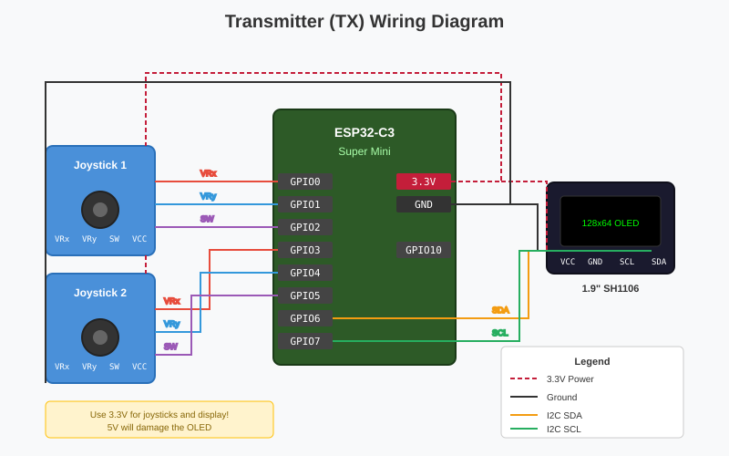
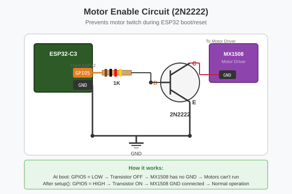
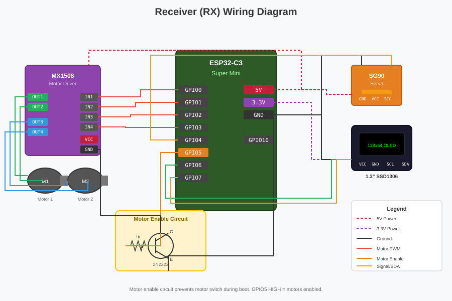
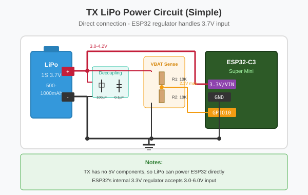
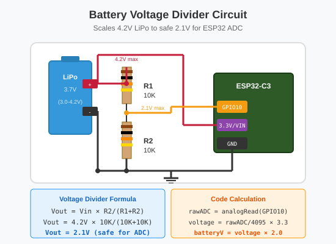
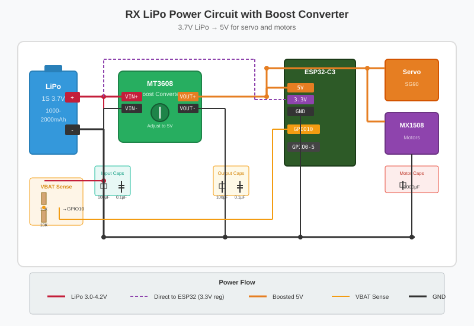

# Complete Wiring Guide - ESP32 Dual Joystick Controller

**Last Updated:** 2026-01-27
**Hardware Version:** v2.2 with DC motors, servo, motor enable circuit, and LiPo battery support

---

## Wiring Diagrams

SVG diagrams are available in the `diagrams/` folder for better visualization:

| Diagram | Description |
|---------|-------------|
| [tx-wiring.svg](diagrams/tx-wiring.svg) | Complete TX wiring overview |
| [rx-wiring.svg](diagrams/rx-wiring.svg) | Complete RX wiring with motor enable circuit |
| [motor-enable-circuit.svg](diagrams/motor-enable-circuit.svg) | 2N2222 transistor motor enable circuit |
| [battery-voltage-divider.svg](diagrams/battery-voltage-divider.svg) | Battery monitoring voltage divider |
| [tx-lipo-power.svg](diagrams/tx-lipo-power.svg) | TX LiPo battery power circuit |
| [rx-lipo-power.svg](diagrams/rx-lipo-power.svg) | RX LiPo battery with boost converter |

---

## Quick Reference

| Board | Display | Actuators | Joysticks | Communication |
|-------|---------|-----------|-----------|---------------|
| **TX** | 1.9" 128x64 OLED | None | 2x HW-504 | BLE/WiFi |
| **RX** | 1.3" 128x64 SH1106 | 1x Servo + 2x DC Motors + MX1508 | None | BLE/WiFi |

**Control Mapping:**
- **Joy1** (TX only): Controls servo on RX
  - Joy1 X-axis → Servo angle (0-180°)
  - Joy1 Y-axis → Not used
- **Joy2** (TX only): Controls both DC motors on RX
  - Joy2 X-axis → Motor 1 (left/right)
  - Joy2 Y-axis → Motor 2 (forward/backward)

---

# TRANSMITTER (TX) WIRING

## TX: What You Need

- 1x ESP32-C3 Super Mini
- 2x HW-504 Joystick modules
- 1x 1.9" OLED Display (128x64, I2C, SSD1306 compatible)
- Jumper wires
- USB-C cable

## TX: Pin Summary

| GPIO | Component | Connection |
|------|-----------|------------|
| 0 | Joystick 1 | VRx (X-axis) |
| 1 | Joystick 1 | VRy (Y-axis) |
| 2 | Joystick 1 | SW (button) |
| 3 | Joystick 2 | VRx (X-axis) |
| 4 | Joystick 2 | VRy (Y-axis) |
| 5 | Joystick 2 | SW (button) |
| 6 | Display | SDA (I2C data) |
| 7 | Display | SCL (I2C clock) |
| 8 | Built-in | LED (blinks) |
| 10 | Battery | Voltage sense (via divider) |
| 3.3V | Power | Joysticks + Display |
| GND | Ground | Common ground |

## TX: Step-by-Step Wiring

### Step 1: Connect Joystick 1

```
HW-504 Joystick 1          ESP32-C3
─────────────────          ────────
Pin 1: GND    (Black)  →   GND
Pin 2: VCC    (Red)    →   3.3V  ⚠️ Use 3.3V (NOT 5V)
Pin 3: VRx    (Blue)   →   GPIO0
Pin 4: VRy    (Green)  →   GPIO1
Pin 5: SW     (Yellow) →   GPIO2
```

**Joystick 1 Physical Layout:**
```
      ┌─────────────────┐
      │                 │
      │      ○          │  ○ = Joystick stick
      │     /│\         │
      │      │          │
      ├─────────────────┤
      │ 1  2  3  4  5   │  ← Pins at bottom
      └─────────────────┘
       │  │  │  │  │
       G  V  V  V  S
       N  C  R  R  W
       D  C  x  y
```

### Step 2: Connect Joystick 2

```
HW-504 Joystick 2          ESP32-C3
─────────────────          ────────
Pin 1: GND    (Black)  →   GND
Pin 2: VCC    (Red)    →   3.3V  ⚠️ Use 3.3V (NOT 5V)
Pin 3: VRx    (Blue)   →   GPIO3
Pin 4: VRy    (Green)  →   GPIO4
Pin 5: SW     (Yellow) →   GPIO5
```

### Step 3: Connect Display (1.9" OLED)

```
OLED Display              ESP32-C3
────────────              ────────
VCC or VDD            →   3.3V  ⚠️ CRITICAL: 3.3V ONLY!
GND                   →   GND
SCL or SCK or SCX     →   GPIO7  (I2C Clock - all same thing!)
SDA                   →   GPIO6  (I2C Data)
```

**Display Physical Layout:**
```
      ┌─────────────────┐
      │                 │
      │   ╔═══════╗     │  ← Screen area
      │   ║ 128x64║     │
      │   ╚═══════╝     │
      ├─────────────────┤
      │ V  G  S  S      │  ← 4 pins at bottom
      │ C  N  C  D      │
      │ C  D  X  A      │  ← "SCX" = I2C Clock (same as SCL/SCK)
      └─────────────────┘
```

**Note on Pin Labels:**
- **SCX = SCL = SCK** → All mean I2C Clock (connect to GPIO7)
- **SDA** → I2C Data (connect to GPIO6)
- Different manufacturers use different labels for the same pins!

**⚠️ CRITICAL WARNING:**
- **ALWAYS use 3.3V for the display**
- **5V will permanently damage the OLED!**
- Double-check before powering on!

### Step 4: Connect USB-C

```
USB-C Cable → ESP32-C3 USB-C port
```

This provides:
- 5V power from computer/adapter
- Programming interface
- Serial monitor output

## TX: Complete Wiring Diagram



*See [diagrams/tx-wiring.svg](diagrams/tx-wiring.svg) for full-size diagram*

## TX: Wiring Checklist

Before powering on, verify each connection:

- [ ] Joystick 1 GND → ESP32 GND
- [ ] Joystick 1 VCC → ESP32 3.3V (NOT 5V!)
- [ ] Joystick 1 VRx → ESP32 GPIO0
- [ ] Joystick 1 VRy → ESP32 GPIO1
- [ ] Joystick 1 SW → ESP32 GPIO2
- [ ] Joystick 2 GND → ESP32 GND
- [ ] Joystick 2 VCC → ESP32 3.3V (NOT 5V!)
- [ ] Joystick 2 VRx → ESP32 GPIO3
- [ ] Joystick 2 VRy → ESP32 GPIO4
- [ ] Joystick 2 SW → ESP32 GPIO5
- [ ] Display GND → ESP32 GND
- [ ] Display VCC → ESP32 3.3V (NOT 5V!)
- [ ] Display SCL/SCK/SCX → ESP32 GPIO7 (I2C Clock)
- [ ] Display SDA → ESP32 GPIO6 (I2C Data)
- [ ] USB-C cable connected
- [ ] No short circuits (check with multimeter)

---

# RECEIVER (RX) WIRING

## RX: What You Need

- 1x ESP32-C3 Super Mini
- 1x SG90 Servo (or compatible)
- 1x MX1508 Motor Driver module
- 2x DC Motors (3.7V rated)
- 1x 1.3" SH1106 OLED Display (128x64, I2C)
- **1x 2N2222 NPN Transistor** (motor enable circuit - prevents boot twitch)
- **1x 1K Resistor** (base resistor for transistor)
- Jumper wires
- USB-C cable or 5V 2A+ power adapter
- **Optional:** 1000µF capacitor (for motor power stability)
- **Optional:** 4x 10K Resistors (additional pull-downs for motor pins)

## RX: Pin Summary

| GPIO | Component | Connection |
|------|-----------|------------|
| 0 | Motor 1 | MX1508 IN1 (forward) |
| 1 | Motor 1 | MX1508 IN2 (reverse) |
| 2 | Motor 2 | MX1508 IN3 (forward) |
| 3 | Motor 2 | MX1508 IN4 (reverse) |
| 4 | Servo | Signal (Joy1 X-axis) |
| 5 | Motor Enable | Transistor base (via 1K resistor) |
| 6 | Display | SDA (I2C data) |
| 7 | Display | SCL (I2C clock) |
| 8 | Built-in | LED (status) |
| 10 | Battery | Voltage sense (via divider) |
| 5V | MX1508 + Servo | VCC (motor + servo power) |
| 3.3V | Display | VCC (display power) |
| GND | All | Common ground |

## RX: Step-by-Step Wiring

### Step 1: Connect Display (1.3" SH1106)

```
SH1106 Display            ESP32-C3
──────────────            ────────
VCC or VDD            →   3.3V  ⚠️ CRITICAL: 3.3V ONLY!
GND                   →   GND
SCL                   →   GPIO7
SDA                   →   GPIO6
```

**Display Physical Layout (same as TX):**
```
      ┌─────────────────┐
      │                 │
      │   ╔═══════╗     │  ← Screen area
      │   ║ 128x64║     │
      │   ╚═══════╝     │
      ├─────────────────┤
      │ V  G  S  S      │  ← 4 pins
      │ C  N  C  D      │
      │ C  D  L  A      │
      └─────────────────┘
```

**⚠️ CRITICAL WARNING:**
- **ALWAYS use 3.3V for the display**
- **5V will permanently damage the OLED!**

### Step 2: Connect Servo (SG90)

```
SG90 Servo               ESP32-C3
──────────               ────────
Brown/Black (GND)    →   GND
Red (VCC)            →   5V
Orange/Yellow (Signal)→  GPIO4
```

**Servo Physical Layout:**
```
      ┌─────────────┐
      │   SG90      │
      │   SERVO     │
      │      ◄──    │  ← Output shaft
      ├─────────────┤
      │ O  R  S     │  ← 3 wires
      │ r  e  i     │
      │ a  d  g     │
      │ n        n  │
      │ g        a  │
      │ e        l  │
      └─────────────┘
```

**Control:**
- Servo controlled by Joy1 X-axis (0-4095 → 0-180°)
- Independent of motor control
- Use for steering, camera pan, or other angular control

**Power Note:**
- Servo draws ~100-500mA depending on load
- Can use ESP32 5V pin for light loads
- For heavy loads or multiple servos, use external 5V power supply

### Step 3: Connect MX1508 Motor Driver

```
MX1508 Module             ESP32-C3
─────────────             ────────
VCC                   →   5V
GND                   →   GND
IN1 (Motor 1 forward) →   GPIO0
IN2 (Motor 1 reverse) →   GPIO1
IN3 (Motor 2 forward) →   GPIO2
IN4 (Motor 2 reverse) →   GPIO3
```

**MX1508 Physical Layout:**
```
      ┌─────────────────────┐
      │     MX1508          │
      │   MOTOR DRIVER      │
      ├─────────────────────┤
      │ OUT1  OUT2  OUT3  OUT4 │  ← Motor outputs (top)
      │  │     │     │     │  │
      │  └─────┘     └─────┘  │  Connect motors here
      │                       │
      │ IN1  IN2  IN3  IN4   │  ← Control inputs (bottom)
      │ GND       VCC        │
      └─────────────────────┘
```

**How MX1508 Works:**
- Each motor has 2 inputs (IN1/IN2 for Motor1, IN3/IN4 for Motor2)
- **Forward:** PWM on IN1, IN2=LOW
- **Reverse:** IN1=LOW, PWM on IN2
- **Stop:** Both pins LOW
- **Brake:** Both pins HIGH (not used in code)

### Step 4: Add Motor Enable Circuit (Prevents Boot Twitch)

**⚠️ IMPORTANT: Without this circuit, motors will briefly twitch when ESP32 boots/resets!**

The ESP32 bootloader can drive GPIO pins during boot, causing motor movement even with pull-down resistors. This circuit cuts power to the MX1508 until your code enables it.



*See [diagrams/motor-enable-circuit.svg](diagrams/motor-enable-circuit.svg) for detailed schematic*

**Components needed:**
- 1x 2N2222 NPN transistor (or similar: 2N3904, BC547, etc.)
- 1x 1K resistor

**Wiring Summary:**
| 2N2222 Pin | Connection |
|------------|------------|
| Base (B) | 1K resistor → GPIO5 |
| Collector (C) | MX1508 GND pin |
| Emitter (E) | ESP32 GND |

**How it works:**
- At boot: GPIO5 is LOW (default) → transistor OFF → MX1508 GND disconnected → motors stay still
- After setup(): Code sets GPIO5 HIGH → transistor ON → MX1508 GND connected → normal operation
- On reset: GPIO5 goes LOW again → motors stop immediately

### Step 5: Connect Motors

```
Motor 1                   MX1508
───────                   ──────
Wire 1 (Red/Brown)    →   OUT1
Wire 2 (Black/Blue)   →   OUT2

Motor 2                   MX1508
───────                   ──────
Wire 1 (Red/Brown)    →   OUT3
Wire 2 (Black/Blue)   →   OUT4
```

**Motor Polarity:**
- If motor spins backward, swap the two wires at MX1508 output
- No code changes needed
- Test with joystick to verify correct direction

### Step 6: Connect Power

**Option A: USB-C Cable (Computer) - ⚠️ Limited Power**
```
USB-C Cable → ESP32-C3 USB-C port
```
- Max current: ~500mA
- Motors may be weak or cause ESP32 to reset
- OK for testing without load

**Option B: 5V Wall Adapter - ✅ Recommended**
```
5V 2A+ Power Adapter → ESP32-C3 5V + GND pins
```
- Provides 2A+ for motors
- ESP32 won't reset under load
- Better performance

### Step 7: Add Capacitor (Optional but Recommended)

```
1000µF Electrolytic Capacitor
──────────────────────────────
+ (Long leg)  →  ESP32 5V pin (same as MX1508 VCC)
- (Short leg) →  ESP32 GND pin (same as MX1508 GND)
```

**Why add capacitor:**
- Smooths voltage spikes from motors
- Prevents ESP32 resets
- Improves motor performance
- Place physically close to ESP32

## RX: Complete Wiring Diagram



*See [diagrams/rx-wiring.svg](diagrams/rx-wiring.svg) for full-size diagram*

For motor enable circuit details, see [diagrams/motor-enable-circuit.svg](diagrams/motor-enable-circuit.svg)

## RX: Wiring Checklist

Before powering on, verify each connection:

- [ ] Display GND → ESP32 GND
- [ ] Display VCC → ESP32 3.3V (NOT 5V!)
- [ ] Display SCL → ESP32 GPIO7
- [ ] Display SDA → ESP32 GPIO6
- [ ] Servo Brown/Black (GND) → ESP32 GND
- [ ] Servo Red (VCC) → ESP32 5V
- [ ] Servo Orange/Yellow (Signal) → ESP32 GPIO4
- [ ] MX1508 VCC → ESP32 5V
- [ ] MX1508 GND → ESP32 GND
- [ ] MX1508 IN1 → ESP32 GPIO0
- [ ] MX1508 IN2 → ESP32 GPIO1
- [ ] MX1508 IN3 → ESP32 GPIO2
- [ ] MX1508 IN4 → ESP32 GPIO3
- [ ] **Motor Enable Circuit:**
- [ ]   - 2N2222 Emitter (E) → ESP32 GND
- [ ]   - 2N2222 Base (B) → 1K resistor → ESP32 GPIO5
- [ ]   - 2N2222 Collector (C) → MX1508 GND pin
- [ ]   - (MX1508 GND no longer connects directly to ESP32 GND!)
- [ ] Motor 1 wires → MX1508 OUT1/OUT2
- [ ] Motor 2 wires → MX1508 OUT3/OUT4
- [ ] 1000µF capacitor across 5V/GND (optional but recommended)
- [ ] Power adapter 5V 2A+ (or USB-C for testing)
- [ ] No short circuits (check with multimeter)

---

# LIPO BATTERY POWER (OPTIONAL)

## Overview

Both boards can run on single-cell LiPo batteries (3.7V nominal) for portable operation. The code includes battery monitoring with low-voltage protection.

**LiPo Battery Basics:**
- **Voltage range:** 3.0V (empty) to 4.2V (full)
- **Nominal voltage:** 3.7V
- **⚠️ CRITICAL:** Never discharge below 3.0V (damages battery permanently)
- **Recommended capacity:** 500-2000mAh depending on runtime needs

## TX: LiPo Battery Circuit

### Components Needed

| Qty | Component | Purpose |
|-----|-----------|---------|
| 1 | 1S LiPo Battery (3.7V, 500-1000mAh) | Power source |
| 2 | 10K Resistors | Voltage divider for monitoring |
| 1 | 100µF Electrolytic Capacitor | Power smoothing |
| 1 | 0.1µF Ceramic Capacitor | High-freq noise filtering |
| 1 | JST-PH 2.0 connector (optional) | Battery connection |

### TX Battery Pin Summary

| GPIO | Function |
|------|----------|
| 10 | Battery voltage sensing (via voltage divider) |

### TX Battery Wiring



*See [diagrams/tx-lipo-power.svg](diagrams/tx-lipo-power.svg) for detailed schematic*



*See [diagrams/battery-voltage-divider.svg](diagrams/battery-voltage-divider.svg) for voltage divider details*

**Voltage divider explained:**
- LiPo outputs 3.0-4.2V
- ESP32 ADC max input: 3.3V
- Divider ratio: 10K/(10K+10K) = 0.5
- 4.2V × 0.5 = 2.1V (safe for ADC)
- Code multiplies by 2.0 to get actual voltage

### TX Battery Checklist

- [ ] LiPo (+) → ESP32 3.3V/VIN pin (or through switch)
- [ ] LiPo (-) → ESP32 GND
- [ ] 10K resistor from LiPo (+) to GPIO10
- [ ] 10K resistor from GPIO10 to GND
- [ ] 100µF capacitor across LiPo (+) and (-)
- [ ] 0.1µF capacitor across LiPo (+) and (-)
- [ ] Battery fully charged before first use

## RX: LiPo Battery Circuit

**⚠️ RX is more complex because servo needs 5V!**

The servo (SG90) requires 5V to operate properly. LiPo provides 3.7V, so you need a boost converter.

### Components Needed

| Qty | Component | Purpose |
|-----|-----------|---------|
| 1 | 1S LiPo Battery (3.7V, 1000-2000mAh) | Power source |
| 1 | MT3608 Boost Converter | 3.7V → 5V for servo/motors |
| 2 | 10K Resistors | Voltage divider for monitoring |
| 1 | 1000µF Electrolytic Capacitor | Motor power smoothing |
| 2 | 100µF Electrolytic Capacitor | ESP32 + boost converter smoothing |
| 2 | 0.1µF Ceramic Capacitor | High-freq noise filtering |
| 1 | JST-PH 2.0 connector (optional) | Battery connection |

### RX Battery Pin Summary

| GPIO | Function |
|------|----------|
| 10 | Battery voltage sensing (via voltage divider) |

### RX Battery Wiring



*See [diagrams/rx-lipo-power.svg](diagrams/rx-lipo-power.svg) for detailed schematic*

**Key connections:**
- LiPo → MT3608 boost converter → 5V for servo and motors
- LiPo → ESP32 VIN directly (internal 3.3V regulator)
- Voltage divider on GPIO10 for battery monitoring

### MT3608 Boost Converter Setup

**Before connecting:**
1. Connect multimeter to VOUT+/VOUT-
2. Apply 3.7V to VIN+/VIN-
3. Adjust potentiometer until output reads **5.0V**
4. Mark the position!

**Capacitor Placement:**
| Location | Capacitors | Purpose |
|----------|------------|---------|
| LiPo output | 100µF + 0.1µF | Input smoothing |
| Boost output | 100µF + 0.1µF | Output smoothing |
| MX1508 | 1000µF | Motor spike absorption |

### RX Battery Checklist

- [ ] LiPo (+) → MT3608 VIN+ AND voltage divider
- [ ] LiPo (-) → MT3608 VIN- AND ESP32 GND
- [ ] MT3608 VOUT+ → ESP32 5V pin (for servo/motors)
- [ ] MT3608 VOUT- → ESP32 GND
- [ ] MT3608 output adjusted to 5.0V
- [ ] ESP32 VIN/3.3V ← LiPo (+) directly (3.3V regulator handles it)
- [ ] 10K resistor from LiPo (+) to GPIO10
- [ ] 10K resistor from GPIO10 to GND
- [ ] 100µF capacitor at LiPo (before boost)
- [ ] 100µF capacitor at boost output
- [ ] 1000µF capacitor at MX1508 (motor power)
- [ ] 0.1µF ceramic capacitors at each location
- [ ] Battery fully charged before first use

## Battery Monitoring in Code

The code automatically:
1. Reads battery voltage every 1 second
2. Shows battery icon on display (3 bars = full, 0 bars = empty)
3. Flashes battery icon when voltage < 3.5V (warning)
4. Disables motors and shows "LOW BATTERY" when voltage < 3.3V
5. Halts completely if voltage < 3.2V on boot (critical)

**Battery voltage thresholds:**
| Voltage | Status | Action |
|---------|--------|--------|
| 4.2V | Full (100%) | Normal operation |
| 3.7V | Medium (50%) | Normal operation |
| 3.5V | Low (25%) | Warning icon flashes |
| 3.3V | Critical (10%) | Motors disabled, warning shown |
| 3.2V | Empty | Boot halted, "BATTERY CRITICAL" |
| <3.0V | Damaged | Battery may be permanently damaged |

## LiPo Safety Warnings

### ⚠️ CRITICAL SAFETY RULES

1. **Never discharge below 3.0V** - damages battery permanently
2. **Never charge unattended** - fire risk
3. **Use proper LiPo charger** - don't charge from USB
4. **Store at 3.7-3.8V** - for long-term storage
5. **Inspect before use** - check for swelling, damage
6. **Don't puncture or crush** - fire/explosion risk
7. **Keep away from heat** - batteries expand when hot

### ⚠️ What to do if battery swells

1. **STOP using immediately**
2. Place in fireproof container (metal box, sand)
3. Take outdoors away from buildings
4. Dispose at battery recycling center
5. **DO NOT puncture or throw in trash**

### ⚠️ Charging

- Use dedicated LiPo charger (1S, 4.2V)
- Never charge above 1C rate (e.g., 500mA for 500mAh battery)
- Charge on fireproof surface
- Never leave charging unattended
- Stop charging when full (charger auto-stops at 4.2V)

---

# POWER REQUIREMENTS

## TX Power Budget

| Component | Voltage | Current | Power |
|-----------|---------|---------|-------|
| ESP32-C3 | 3.3V | 200mA | 0.66W |
| Joystick 1 | 3.3V | 10mA | 0.03W |
| Joystick 2 | 3.3V | 10mA | 0.03W |
| OLED 128x64 | 3.3V | 20mA | 0.07W |
| **TOTAL** | **3.3-5V** | **~250mA** | **~0.8W** |

**Power Sources:**
- USB-C (computer or wall adapter) - 5V
- 1S LiPo battery (500-1000mAh) - 3.7V nominal

**LiPo Runtime Estimate:**
- 500mAh battery: ~2 hours
- 1000mAh battery: ~4 hours

## RX Power Budget

| Component | Voltage | Current | Power |
|-----------|---------|---------|-------|
| ESP32-C3 | 3.3V | 200mA | 0.66W |
| OLED 128x64 | 3.3V | 20mA | 0.07W |
| Servo (SG90) | 5V | 100-500mA | 0.5-2.5W |
| MX1508 Driver | 5V | 50mA | 0.25W |
| Motor 1 (max) | 3.7V | 1000mA | 3.7W |
| Motor 2 (max) | 3.7V | 1000mA | 3.7W |
| **TOTAL** | **5V** | **~2.8A** | **~11W** |

**Power Source Options:**

1. **USB-C (Computer)** - ⚠️ Limited
   - Max 500mA
   - Motors weak, may stall
   - ESP32 may reset under load
   - OK for testing only

2. **USB-C (Wall Adapter)** - ✅ Recommended
   - 2A minimum
   - 3A recommended for best performance
   - No resets
   - Full motor power

3. **External Power Supply** - ✅ Best
   - 5V 3A bench supply
   - Connect to ESP32 5V/GND pins
   - Most stable option

4. **1S LiPo Battery + Boost Converter** - ✅ Portable
   - 1000-2000mAh battery recommended
   - MT3608 boost converter for 5V
   - Runtime: 20-60 minutes under load
   - Battery monitoring protects from over-discharge

---

# CRITICAL SAFETY WARNINGS

## ⚠️ Display Voltage - READ THIS!

**BOTH displays MUST use 3.3V ONLY**

❌ **DO NOT connect displays to 5V**
✅ **ALWAYS connect displays to 3.3V**

**If you connect 5V to the display:**
- Display will be permanently damaged
- No smoke or fire, it just dies
- Cannot be repaired
- Must buy new display

**How to verify:**
1. Use multimeter on 3.3V pin before connecting
2. Should read 3.25V - 3.35V
3. If you see 4.5V - 5.5V, you're on the WRONG pin!

## ⚠️ Joystick Voltage

**Use 3.3V for joysticks (NOT 5V)**

Why:
- ESP32-C3 ADC maximum input: 3.3V
- 5V joysticks will clip at 3.3V
- Non-linear readings
- 3.3V provides full range with better linearity

## ⚠️ Motor Power

**Motors can draw high current**

- Each motor can draw 1-2A under load
- USB computer port: 500mA max → motors will be weak
- Use 5V 2A+ wall adapter for proper operation
- Add 1000µF capacitor to prevent voltage drops
- If ESP32 resets when motors run → insufficient power

## ⚠️ Polarity

**Check polarity before powering on:**

- Electrolytic capacitors have polarity (+/-)
- Wrong polarity can cause capacitor to explode
- Motors don't have polarity (just swap wires if backward)
- Power supplies: Red=+5V, Black=GND

---

# TESTING PROCEDURE

## Step 1: Visual Inspection

**Before connecting power:**
- [ ] Check all connections against checklist
- [ ] Verify display on 3.3V (NOT 5V!)
- [ ] Verify joysticks on 3.3V (NOT 5V!)
- [ ] Check for loose wires
- [ ] Check for short circuits between 3.3V/5V and GND

## Step 2: Power Test

**TX Board:**
1. Connect USB-C cable
2. LED should blink every 500ms
3. Display should light up and show "TX: WiFi OK" or "TX: BLE Mode"
4. If display blank → check wiring
5. If display dim → verify 3.3V voltage

**RX Board:**
1. Connect power (USB-C or 5V adapter)
2. Display should light up and show "RX: WiFi OK" or "RX: BLE Mode"
3. If display blank → check wiring
4. Motors should NOT move yet (waiting for connection)

## Step 3: Communication Test

**BLE Mode:**
1. Wait 10 seconds for auto-pairing
2. TX display should show "TX" or "WiFi" (top right)
3. RX display should show "RX" or "WiFi" (top right)
4. Both displays should show joystick circles

**WiFi Mode:**
1. Both boards connect to "amplifi" network
2. TX display shows IP address
3. RX discovers TX via mDNS
4. Status shows "WiFi" on both displays

## Step 4: Joystick Test

**On TX board:**
1. Move Joystick 1 in all directions
2. Circle on display should update
3. Joystick 2 same test
4. Push buttons → dot should fill in
5. Check serial monitor for values

## Step 5: Motor Test

**On RX board (motors connected):**

**⚠️ Start with motors NOT under load (wheels in air)**

1. Move TX Joystick 2 right → Motor 1 should spin forward
2. Move TX Joystick 2 left → Motor 1 should spin reverse
3. Move TX Joystick 2 up → Motor 2 should spin forward
4. Move TX Joystick 2 down → Motor 2 should spin reverse
5. Center joystick → both motors stop

**If motor spins wrong direction:**
- Swap the two wires at MX1508 output terminals
- No code changes needed

**Check displays:**
- TX shows "fake motor speeds" (calculated from Joy2)
- RX shows "actual motor speeds" (PWM values)
- Both should show bars growing/shrinking with joystick movement
- Direction arrows (< >) should match movement

## Step 6: Load Test

**If motors work in air:**
1. Put wheels on ground
2. Test again under load
3. If ESP32 resets → need more power (use 5V 2A+ adapter)
4. If motors weak → check power supply current rating
5. Add 1000µF capacitor if not already installed

---

# TROUBLESHOOTING

## Display Issues

| Problem | Solution |
|---------|----------|
| Display blank | 1. Check 3.3V voltage (3.25-3.35V)<br>2. Check I2C wiring (SDA/SCL)<br>3. Try different I2C address (0x3C or 0x3D) |
| Display dim | 1. Low voltage - verify 3.3V<br>2. Check `setContrast(255)` in code<br>3. Check power supply quality |
| Display garbage | 1. I2C wires swapped (SDA/SCL)<br>2. Wrong display type in code<br>3. Loose connection |
| Compile error | 1. Missing library - run `make install-libs`<br>2. Wrong controller (SSD1306 vs SH1106) |

## Motor Issues

| Problem | Solution |
|---------|----------|
| **Motors twitch on boot/reset** | 1. Add motor enable circuit (2N2222 transistor on GPIO5)<br>2. This cuts MX1508 ground until code enables it<br>3. Pull-down resistors alone don't work because bootloader can drive pins<br>4. See Step 4 in RX wiring for circuit diagram |
| Motors don't spin | 1. Check MX1508 power (5V)<br>2. Verify GPIO0-3 connections<br>3. Check motor wiring to OUT1-4<br>4. Test TX Joy2 joystick |
| Motors spin weakly | 1. Insufficient power - use 5V 2A+ adapter<br>2. Add 1000µF capacitor<br>3. Check motor voltage rating |
| ESP32 resets | 1. Motor current too high for USB<br>2. Use external 5V 2A+ power<br>3. Add 1000µF capacitor<br>4. Reduce motor load |
| Wrong direction | 1. Swap motor wires at MX1508 output<br>2. No code changes needed |
| Motors jitter | 1. Increase `MOTOR_DEADZONE` in code<br>2. Add filtering<br>3. Check power stability |
| One motor works | 1. Check wiring for non-working motor<br>2. Swap motors to test which is faulty<br>3. Check MX1508 outputs with multimeter |

## Joystick Issues

| Problem | Solution |
|---------|----------|
| Joystick stuck at 4095 | 1. Joystick on 5V → change to 3.3V<br>2. Check ADC pin wiring |
| Center not zero | 1. Normal - adjust center values in code<br>2. Measure center: `JOY1_CENTER_X`, etc. |
| Values jitter | 1. Software filtering already enabled<br>2. Add 0.1µF capacitor to ADC pins<br>3. Check joystick power |
| Button not working | 1. Check pull-up enabled in code<br>2. Verify GPIO connection<br>3. Button is active-LOW (pressed=LOW) |

## Communication Issues

| Problem | Solution |
|---------|----------|
| No connection | 1. Check both boards same mode (BLE/WiFi)<br>2. Verify code uploaded correctly<br>3. Check serial monitor for errors |
| BLE won't pair | 1. Move boards closer (<10m)<br>2. Restart both boards<br>3. Check BLE not disabled in code |
| WiFi won't connect | 1. Verify SSID/password correct<br>2. Check 2.4GHz WiFi enabled<br>3. Check router allows device-to-device |
| Slow response | 1. Normal - 100ms update rate<br>2. Check WiFi signal strength<br>3. Reduce WiFi interference |

## Power Issues

| Problem | Solution |
|---------|----------|
| ESP32 won't power on | 1. Check USB cable<br>2. Try different USB port<br>3. Check for short circuit |
| Random resets | 1. Motors drawing too much current<br>2. Use 5V 2A+ power adapter<br>3. Add 1000µF capacitor |
| Low 3.3V voltage | 1. Should be 3.25-3.35V<br>2. Too much load on 3.3V rail<br>3. Check ESP32 regulator |

---

# BILL OF MATERIALS (BOM)

## Main Components

| Qty | Component | Notes |
|-----|-----------|-------|
| 2 | ESP32-C3 Super Mini | One for TX, one for RX |
| 2 | HW-504 Joystick Module | Analog XY + button |
| 1 | 1.9" OLED 128x64 (SSD1306) | TX display, I2C, 3.3V |
| 1 | 1.3" OLED 128x64 (SH1106) | RX display, I2C, 3.3V |
| 1 | SG90 Servo (or compatible) | Controlled by Joy1 X-axis |
| 1 | MX1508 Motor Driver | Dual H-bridge |
| 2 | DC Motor 3.7V | Any small DC motor |
| 1 | 2N2222 NPN Transistor | Motor enable circuit (prevents boot twitch) |
| 1 | 1K Resistor | Base resistor for transistor |
| 2 | USB-C Cable | For programming/power |

## Optional Components

| Qty | Component | Purpose |
|-----|-----------|---------|
| 1 | 1000µF Electrolytic Capacitor | Motor power smoothing |
| 2 | 100µF Electrolytic Capacitor | ESP32 power stability |
| 4 | 0.1µF Ceramic Capacitor | Joystick ADC filtering |
| 1 | 5V 3A Power Adapter | External motor power |
| 1 | Breadboard 830 points | TX prototyping |
| 1 | Breadboard 830 points | RX prototyping |
| 30+ | Jumper Wires | Various connections |

## LiPo Battery Components (for portable operation)

| Qty | Component | Purpose |
|-----|-----------|---------|
| 1 | 1S LiPo Battery 500-1000mAh | TX power source |
| 1 | 1S LiPo Battery 1000-2000mAh | RX power source |
| 1 | MT3608 Boost Converter | 3.7V→5V for RX servo/motors |
| 4 | 10K Resistor | Voltage dividers (2 per board) |
| 2 | 100µF Electrolytic Capacitor | Power smoothing |
| 2 | 0.1µF Ceramic Capacitor | High-freq noise filtering |
| 1 | 1S LiPo Charger | Battery charging (TP4056 module) |
| 2 | JST-PH 2.0 Connector | Battery connection (optional) |
| 1 | SPDT Slide Switch | Power on/off (optional) |

## Tools Needed

| Tool | Purpose |
|------|---------|
| Multimeter | Verify voltages, check continuity |
| Wire stripper | Prepare wires |
| Small screwdriver | Adjust connections |
| Computer | Programming, serial monitor |

---

# WIRE COLOR RECOMMENDATIONS

Use these colors for easier debugging:

**Power:**
- Red = VCC/3.3V/5V (positive)
- Black = GND (ground)

**I2C:**
- Yellow = SDA (data)
- Green = SCL (clock)

**Analog/PWM:**
- Blue = ADC input / PWM output
- Orange = Secondary ADC input
- Purple = Digital input (buttons)

**Motors:**
- Red/Brown = Motor + (positive)
- Black/Blue = Motor - (negative)

---

# QUICK START

**Already have everything wired? Start here:**

1. **Install libraries:**
   ```bash
   make install-libs
   ```

2. **Compile and upload (WiFi mode):**
   ```bash
   make wifi-all
   ```

3. **Or use BLE mode:**
   - Comment out `#define USE_WIFI` in both .ino files
   - Run: `make all`

4. **Test:**
   - Move joysticks on TX → see on both displays
   - Move Joy2 → motors spin on RX
   - Check motor bars match on both displays

---

**Document Version:** 2.2
**Last Verified:** 2026-01-27
**For help:** See README.md or CLAUDE.md
